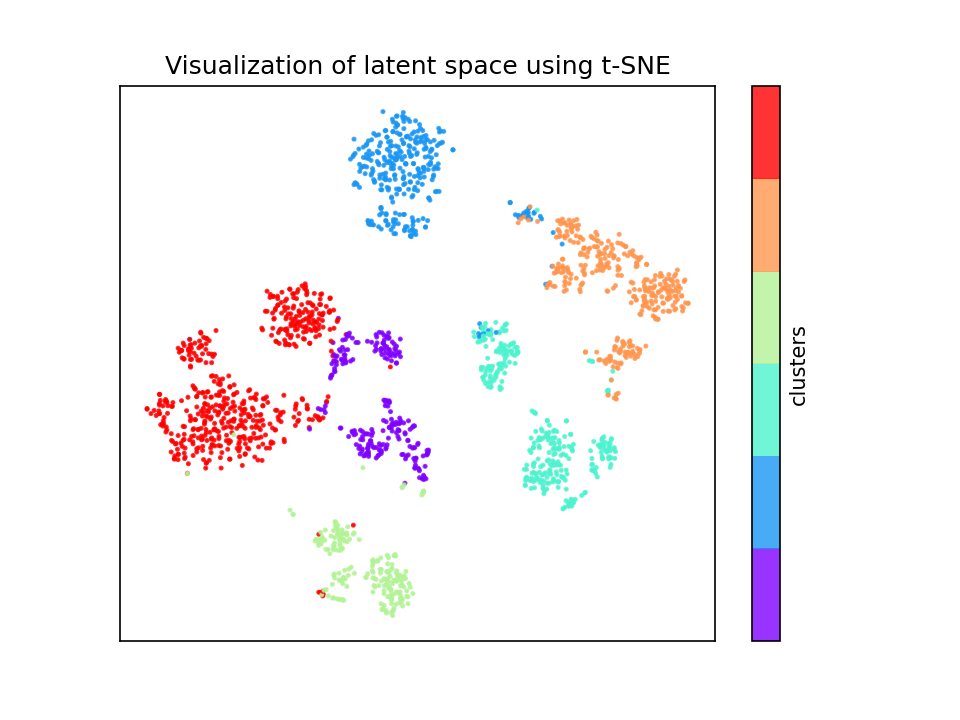

## 基于自编码器的蛋白质构象聚类模型

本模型从蛋白质模拟轨迹中提取各相邻残基alpha碳间的键角及二面角数据，用自编码器（Auto Encoder）对键角二面角数据进行降维，对低维数据进行聚类。

### 安装

模型基于python3，主要依赖包有`mdtraj`, `pytorch`, `sklearn`, `tqdm`等。
```bash
pip install -r requirments.txt
```


### 数据预处理

在`trajectory`路径下新建文件夹。将待处理的仅包含蛋白质的模拟轨迹的拓扑文件（pdb格式）和轨迹文件放入其中。运行以下命令

```bash
python preprocessing.py -trjfolder name_of_folder -trjtype xtc
```
各参数含义： 

`-trjfolder`--轨迹所在文件夹相对路径，默认值example。 

`-trjtype`--轨迹文件格式，默认值xtc。

运行结束后，在原轨迹文件夹下，得到`lmptrj`文件夹，其中包含lammpstrj格式的轨迹数据；得到`ca_lmptrj`文件夹，其中为仅含有蛋白质各残基alpha碳信息的lammpstrj格式轨迹数据；在`dataset`文件夹下得到轨迹数据对应的键角二面角数据集，作为自编码器模型的输入。

### 模型训练

自编码器以`dataset`文件夹下的各数据集作为模型输入。通过以下命令进行训练

```bash
python train.py -ds name_of_dataset
```

各参数含义：

`-ds`--数据集名称，默认值example，

`-bs`--batch size，默认值500，

`-opt`--优化函数，默认值Adam，

`-lr`--learning rate，默认值0.01，

`-sr`--采样率，默认值1，

`-ld`--隐空间维数，默认值10，

`-ids`--编码器及解码器各层网络宽度数组，默认值1000 1000 1000。当ids值为a b c d时，编码器及解码均为4层，编码器各层层数为a、b、c、d，解码器各层宽度为d、c、b、a。

训练完成后，在`training_result`文件夹中得到各数据集对应的文件夹。各文件夹下包含每个数据集各次训练结果。每次训练均生成4个子文件夹：
1. `checkpoint`包含每个epoch对应的网络参数。
2. `tensorboard`包含tensorboard文件。
3. `latent`包含训练完成后的数据降维结果。
4. `image`包含训练完成后模型输入与输出的对比。

### 数据降维

本模型使用K-means方法对低维数据进行降维，同时用t-SNE对低维数据进行可视化。可通过以下命令实现
```bash
python cluster.py -ds example -cc 8
```

各参数含义：

`-ds`--数据集名称， 默认值example，

`-mt`--自编码器模型训练的时间，格式为FCAE_yy-mm-dd-hh-mm-ss，

`-cc`--目标类数， 默认值10，

`-sr`--采样率，默认值0.01。

聚类完成后，在`clustering_result`文件夹中得到各数据集对应的文件夹。各文件夹下包含每个数据集各次聚类结果，其中包含各类的构象、中心构象和t-SNE方法生成的低维空间数据分布图。

### Example

fs-peptide是结构简单的单链蛋白，以两段共20000帧的fs-peptide模拟轨迹（获取自[mdtraj](https://mdtraj.org/1.9.4/index.html)）来说明本模型的运行方法。

1. 数据预处理

所需的轨迹文件和拓扑文件在`trajectory/example`文件夹中，运行以下命令

```bash
python preprocessing.py -trjfolder example -trjtype xtc
```

运行完成后，在`dataset`文件夹下得到`example`文件夹，其中有`trajectory-1.angdih`和`trajectory-2.angdih`两个文件，分别对应两段轨迹。

2. 自编码器训练

经过调参，对于fs-peptide，编码器和解码器均为3层，每层宽度1000，隐空间维数为10时，训练效果较好。数据集大小仅为20000，所以sample rate可设为1。运行以下命令，

```bash
python train.py -ds example -ep 100 -sr 1 -ld 10 -ids 1000 1000 1000
```

模型自动将数据集按4:1划为训练集和测试集。训练结束后得到`example.log`文件，记录训练时间以及模型的各项参数。在`training_result`下得到`example`文件夹，其中有各次训练的结果，每次训练结果的文件夹用训练时间命名。训练结果包含四个文件夹：checkpoint、image、latent和tensorboard。其中`latent`为训练完成后的隐变量，用作下一步聚类；`image`文件夹记录训练完成后输入输出的对比，以下是几个示例。


3. 隐变量聚类

上一步降维得到的隐变量储存在`training_result/example/FCAE_2021-01-24-16-15-54/latent`下，通过运行以下命令对隐变量进行K-Means聚类。

```bash
python cluster.py -ds example -mt FCAE_2021-01-24-16-15-54 -sr 0.1 -cc 6
```

此数据集数据量为20000，较小故sample rate取0.1，目标类数设为6。得到各类样本数为：

```bash
[INFO] The number of frames of each cluster:
cluster 1: 234 frames
cluster 2: 333 frames
cluster 3: 322 frames
cluster 4: 210 frames
cluster 5: 348 frames
cluster 6: 553 frames
```

在`clustering_result`路径下得到聚类结果。其中包括不同目标类数时各类的构象及中心构象、隐空间可视化图。目标类数为6时隐空间可视化图如下



由于本数据集数据量较少所以用t-SNE方法可视化较好。

得到各类的中心构象如下图

